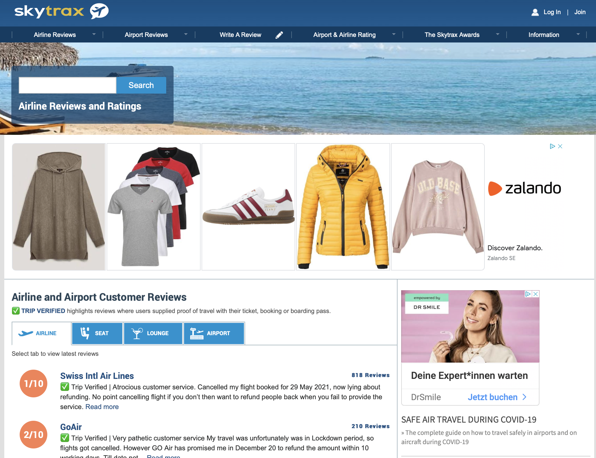
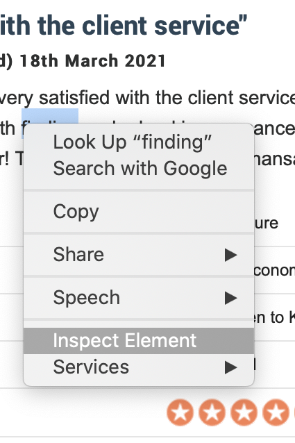
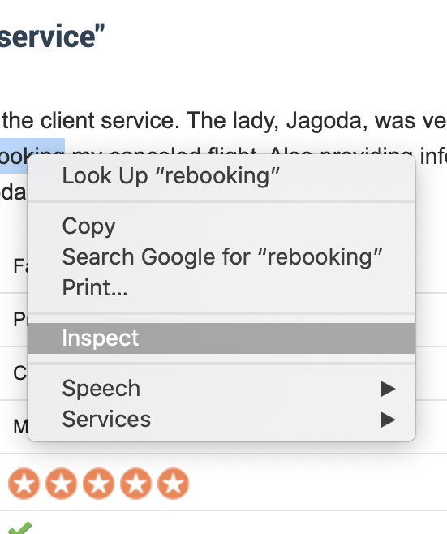
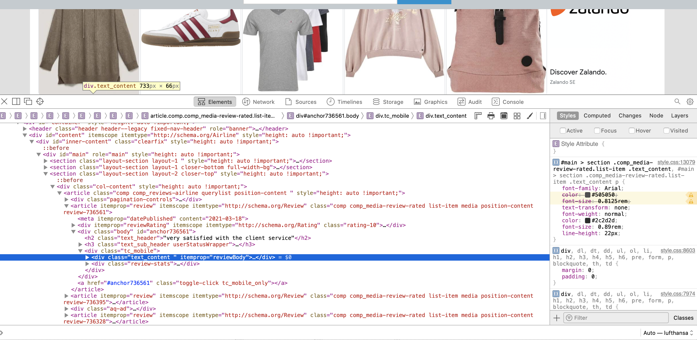
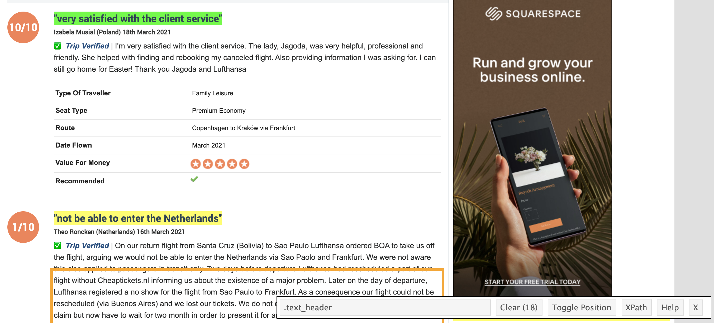

```{r setup, include=FALSE}
knitr::opts_chunk$set(echo = TRUE)
```


Welcome to our fourth session of Data Science. Today, we are going to explore together how to scrape data from a website.

To do so, we again need different packages. The most important package we will rely on today is

rvest

Please install and load the corresponding package with the library command.

```{r eval=TRUE, echo=TRUE}
library(rvest)
```


rvest is a nice little package that allows us to automatically extract repeated content from any website on the internet that uses HTML.

This makes rvest a really powerful tool. But before we dive into the code and application, it may make sense to first think a bit about how websites are composed. 

Probably most of you know that HTML is the main language to build a website. Of course, there are also other elements on websites (like e.g. JAVA or PHP). However, knowing and understanding the basic structure of HTML already allows us to easily identify re-occurring elements on a website. 

Let's assume for today that we are interested in comparing airlines and want to figure out what customers like about a specific airline and what customers do not like about a specific airline. 

One way to answer this question is to compare customer reviews of airlines and to check if specific words occur more often in reviews of a specific airline.

Luckily, there is a web page that collects customer reviews for a large set of airlines and allows customers from all over the world to rate and review their airline experience.

You can find this website here:

[Skytrax](https://https://www.airlinequality.com)



### HTML Code and how to spot Elements of a Website 

To inspect the HTML code of a website, we can use our ordinary browsers. To do so, we simply use the brower's Inspect function which you can easily select through right clicking on an element of the web page. Below you can see examples from Apple's Safari browser and Google's Chrome browser.






Once you click on the Inspect Element or Inspect button, your browser will show you the web page's HTML code which should look like the following.



Re-occuring elements in a web page will always be introduced in the HTML code with a specific tag. So in our case, the review text element of each review is introduced in the HTML text through the tag <.text_content> 

You can easily find these tags by right clicking on the review text, selecting the inspect tool of your browser and screening the HTML code. Sometimes, however, this can be difficult or the code is written in a rather nontransparent way. So instead of wasting time browsing through hundreds of lines of code, we can rely on the help of a little smart tool called 

### Selector Gadget

The Selector Gadget is an add-on for Google's Chrome browser. You can find it here and install it in your Chrome browser.

[Selector Gadget](https://selectorgadget.com)

The link will also provide you with a short tutorial video in which you learn how to install the gadget and how to use it to identify different elements within a web page.

Once you have installed Selector Gadget, let's start getting some data.

### Data Crawling

Let's assume we want to compare Turkish Airlines and Lufthansa. To do so, let's crawl 100 reviews for each airline.

To do so, we have to rely on rvest. First, we go to Skytrax' review pages of each airline. For Lufthansa, the corresponding URL looks like

[https://www.airlinequality.com/airline-reviews/lufthansa/](https://www.airlinequality.com/airline-reviews/lufthansa/)

For Turkish Airlines, the review pages can be found with the following URL

[https://www.airlinequality.com/airline-reviews/turkish-airlines](https://www.airlinequality.com/airline-reviews/turkish-airlines)

Using the Selector Gadget we can now go through each element of the first review to identify the tags necessary to automatically extract the different elements of the review and export them for all reviews on this page into a data frame in R. 

  
<br />
<br />  

Below you will find a list of all relevant tags for different elements of an airline review.  


Review Element  | Tag
------------- | -------------
Headline of Review:  |  <.text_header>
Overall Rating Score:  | <.rating-10>
Name of Author:  | <.userStatusWrapper span > span>
Review Text:  | <.review_text>

      
  

You will realize that many of the reviews also contain other information. So far, we will ignore this information but feel free to use the Selector Gadget to further identify the relevant tags for the other information items in the reviews.

Once we have all the tags, we can start writing our first lines of code to collect data.

The first thing we need to do is to tell the rvest package where to get the information from. So we need to specify the links for Lufthansa and Turkish Airlines. 

Then we continue by asking the rvest package to inspect all HTML elements on the landing page of the link and to extract all content that is highlighted by our tags. 

Subsequently, we store each element in a variable and once we have all elements, we bind them together in a data frame.


```{r eval=TRUE, echo=TRUE}
## For Lufthansa

linkLH = "https://www.airlinequality.com/airline-reviews/lufthansa/?sortby=post_date%3ADesc&pagesize=100"

skytraxshtmlLH = read_html(linkLH)

Review_Title.LH <- read_html(linkLH) %>% 
    html_nodes(".querylist") %>%
    html_nodes(xpath = ".//article[contains(@class, 'comp comp_media-review-rated list-item media position-content review-')]") %>%
    html_node (".text_header") %>%
    html_text() %>%
    unlist()
  
Overall_Rating.LH <- read_html(linkLH) %>% 
    html_nodes(".querylist") %>%
    html_nodes(xpath = ".//article[contains(@class, 'comp comp_media-review-rated list-item media position-content review-')]") %>%
    html_nodes(".rating-10") %>%
    html_node("span:nth-child(1)") %>%
    html_text() %>%
    unlist()

Author.LH <- read_html(linkLH) %>% 
    html_nodes(".querylist") %>%
    html_nodes(xpath = ".//article[contains(@class, 'comp comp_media-review-rated list-item media position-content review-')]") %>%
    html_node(".userStatusWrapper span > span") %>%
    html_text() %>%
    unlist()

Review_Text.LH <- read_html(linkLH) %>% 
    html_nodes(".querylist") %>%
    html_nodes(xpath = ".//article[contains(@class, 'comp comp_media-review-rated list-item media position-content review-')]") %>%
    html_node(".text_content") %>%
    html_text() %>%
    unlist()

# Now we can combine all elements by stitching them together column by column. In R, we achieve this through the cbind command (cbind stands for column binding).

Lufthansa.Reviews = as.data.frame(cbind(Review_Title.LH, Overall_Rating.LH, Author.LH, Review_Text.LH))

## For Turkish Airlines

linkTHY = "https://www.airlinequality.com/airline-reviews/turkish-airlines/?sortby=post_date%3ADesc&pagesize=100"

skytraxshtmlTHY = read_html(linkTHY)

Review_Title.THY <- read_html(linkTHY) %>% 
    html_nodes(".querylist") %>%
    html_nodes(xpath = ".//article[contains(@class, 'comp comp_media-review-rated list-item media position-content review-')]") %>%
    html_node (".text_header") %>%
    html_text() %>%
    unlist()
  
Overall_Rating.THY <- read_html(linkTHY) %>% 
    html_nodes(".querylist") %>%
    html_nodes(xpath = ".//article[contains(@class, 'comp comp_media-review-rated list-item media position-content review-')]") %>%
    html_nodes(".rating-10") %>%
    html_node("span:nth-child(1)") %>%
    html_text() %>%
    unlist()

Author.THY <- read_html(linkTHY) %>% 
    html_nodes(".querylist") %>%
    html_nodes(xpath = ".//article[contains(@class, 'comp comp_media-review-rated list-item media position-content review-')]") %>%
    html_node(".userStatusWrapper span > span") %>%
    html_text() %>%
    unlist()

Review_Text.THY <- read_html(linkTHY) %>% 
    html_nodes(".querylist") %>%
    html_nodes(xpath = ".//article[contains(@class, 'comp comp_media-review-rated list-item media position-content review-')]") %>%
    html_node(".text_content") %>%
    html_text() %>%
    unlist()

# Now we can combine all elements by stitching them together column by column. In R, we achieve this through the cbind command (cbind stands for column binding).

TurkishAirlines.Reviews = as.data.frame(cbind(Review_Title.THY, Overall_Rating.THY, Author.THY, Review_Text.THY))

```

  
We have now two data frames with the information for Lufthansa and Turkish Airlines. Let's see for each frame what the first rows look like. We can achieve this through R's glimpse command from the dplyr package, which we will first load dplyr and then inspect the Lufthansa data frame.   

```{r eval=TRUE, echo=TRUE}
library(dplyr)
glimpse(Lufthansa.Reviews)
```

Congratulations, you just managed to crawl your first web page! 

### Bonus Track

Let's now just have a look at what we can do with this data! Don't worry if the code still looks unfamiliar! We will cover the usage of text mining tools and text visualization methods in subsequent sessions!


```{r eval=TRUE, echo=TRUE}
library(tm)
library(wordcloud)

## First, we split our data frames for each airline in two separate frames with the positive and the negative reviews.

## To do so, we need to first convert the the column Overall_Rating into an integer format.

Lufthansa.Reviews$Overall_Rating.LH = as.integer(Lufthansa.Reviews$Overall_Rating.LH)
TurkishAirlines.Reviews$Overall_Rating.THY = as.integer(TurkishAirlines.Reviews$Overall_Rating.THY)

## Then we filter the reviews by the overall score. Reviews with a score higher than 6 will be assigned to a new frame that collects all good reviews. Reviews with a score lower than 4 will be assigned to a new frame that collects all bad reviews.

LufthansaGoodReviews = Lufthansa.Reviews %>% filter(Overall_Rating.LH > 6)
LufthansaBadReviews = Lufthansa.Reviews %>% filter(Overall_Rating.LH < 4)

THYGoodReviews = TurkishAirlines.Reviews %>% filter(Overall_Rating.THY > 6)
THYBadReviews = TurkishAirlines.Reviews %>% filter(Overall_Rating.THY < 4)
```


If you now inspect the number of reviews in the bad and the good frame, you will realize that we have way more bad reviews than good reviews. This is something very typical for online review sites. People are commonly more motivated to come to these sites when they are unhappy than when they are happy or satisfied. Something we should certainly keep in mind when interpreting this data!   

So it might be better to focus now only on the bad reviews and see what people specifically dislike for each airline.

Let's plot for each airline's bad review frames a wordcloud. Take your knowledge from our last session and plot two wordclouds! Your output should look like below.

```{r eval=TRUE, echo=FALSE, warning=FALSE}
LufthansaBadReviews$Review_Text.LH <- sapply(LufthansaBadReviews$Review_Text.LH,function(row) iconv(row, "latin1", "ASCII", sub=""))

THYBadReviews$Review_Text.THY <- sapply(THYBadReviews$Review_Text.THY,function(row) iconv(row, "latin1", "ASCII", sub=""))

## Build Corpus

CorpLHBad <- Corpus(VectorSource(LufthansaBadReviews$Review_Text.LH))
CorpTHYBad <- Corpus(VectorSource(THYBadReviews$Review_Text.THY))

## Clean Corpus LH

CorpLHBad <- CorpLHBad %>%
  tm_map(removeNumbers) %>%
  tm_map(removePunctuation) %>%
  tm_map(stripWhitespace)
  
CorpLHBad <- tm_map(CorpLHBad, content_transformer(tolower))
CorpLHBad <- tm_map(CorpLHBad, removeWords, c(stopwords("english"), "\u2705", "trip", "verified"))

## Clean Corpus THY

CorpTHYBad <- CorpTHYBad %>%
  tm_map(removeNumbers) %>%
  tm_map(removePunctuation) %>%
  tm_map(stripWhitespace)
CorpTHYBad <- tm_map(CorpTHYBad, content_transformer(tolower))
CorpTHYBad <- tm_map(CorpTHYBad, removeWords,  c(stopwords("english"), "\u2705", "trip", "verified"))

## Build Cloud for LH

dtm.LH <- TermDocumentMatrix(CorpLHBad) 
matrix.LH <- as.matrix(dtm.LH) 
words.LH <- sort(rowSums(matrix.LH),decreasing=TRUE) 
df.LH <- data.frame(word = names(words.LH),freq=words.LH)

set.seed(1234) # for reproducibility 
wordcloud(words = df.LH$word, freq = df.LH$freq, min.freq = 5,max.words=50, random.order=FALSE, rot.per=0.35,  colors=brewer.pal(8, "Dark2"))

## Build Cloud for THY

dtm.THY <- TermDocumentMatrix(CorpTHYBad) 
matrix.THY <- as.matrix(dtm.THY) 
words.THY <- sort(rowSums(matrix.THY),decreasing=TRUE) 
df.THY <- data.frame(word = names(words.THY),freq=words.THY)

set.seed(1234) # for reproducibility 
wordcloud(words = df.THY$word, freq = df.THY$freq, min.freq = 5,max.words=50, random.order=FALSE, rot.per=0.35,  colors=brewer.pal(8, "Dark2"))

```

So what can we take away from the two plots? Seems like there are no substantial differences in what people complain about for the two airlines. However, it is still striking to see that THY has a substantially lower average rating than LH. Any idea why this could be the case?

Next week we are going to learn how to use dictionaries to conduct more sentiment analyses. To practice data crawling, please consider the assignment below.

### Assigment 

Try to collect more information from the Skytrax website. Then, try to build wordlcouds for different types of aircrafts (i.e. Airbus vs. Boeing) and different destinations.   

</br >  


